# Jiaxin Lin (林嘉馨)

**Sun Yat-sen University (中山大学)** · Materials (minor: Microelectronics) · Shenzhen

---

### About Me

I'm currently a senior undergraduate student at Sun Yat-sen University and I'm looking for funded Ph.D. position.

---

### Featured Projects
<table>
<tr>
<td width="50%" valign="top">

**[🖥️ ysyx-workbench](https://github.com/jiaxinlin-jessy/ysyx-workbench)**

RISC-V emulator (NEMU) with GDB-style debugger for the One Student One Chip (ysyx) program. PA1 complete. Currently working through the curriculum...

`C` `RISC-V` `Systems` `Emulator`

</td>
<td width="50%" valign="top">

**[⚛️ computational-materials-SYSU-2026](https://github.com/jiaxinlin-jessy/computational-materials-SYSU-2026)**

Theoretical notes & coursework for Computational Materials Science (Spring 2026), focusing on first-principles calculation methods using VASP.

`VASP` `DFT` `First-Principles` `Jupyter`

</td>
</tr>
<tr>
<td width="50%" valign="top">

**[🧪 perovskite-passivation-ml](https://github.com/jiaxinlin-jessy/perovskite-passivation-ml)**

ML & reinforcement learning pipeline for screening and generating HTL/perovskite interface passivation agents. Achieves **PCE = 17.45%** with AI-designed molecules.

`Python` `Machine Learning` `Perovskite` `Solar Cells`

</td>
<td width="50%" valign="top">

**[🤖 AI-assisted-Materials-Design-SYSU-2025](https://github.com/jiaxinlin-jessy/AI-assisted-Materials-Design-SYSU-2025)**

Course labs for AI-Assisted Materials Design @ SYSU School of Materials. Score: **98/100**. Rank **1st**. Covers Materials Project API, linear ML, clustering, and neural network-based cohesive energy prediction.

`Python` `Neural Networks` `Materials Project` `Jupyter`

</td>
</tr>
<tr>
<td width="50%" valign="top">

**[🏅 2025-MCM-ICM-Problem-C](https://github.com/jiaxinlin-jessy/2025-MCM-ICM-Problem-C)**

Olympic medal prediction using Word2Vec and Random Forest regression. Awarded **Meritorious Winner** at the 2025 MCM/ICM competition.

`Python` `Word2Vec` `Random Forest` `Mathematical Modeling`

</td>
<td width="50%" valign="top">
</td>
</tr>
</table>

---

### Skills

**Programming & Tools**

**Simulation & Scientific Computing**

---

### Contact

📧 [linjx227@mail2.sysu.edu.cn](mailto:linjx227@mail2.sysu.edu.cn)

💬 

🌐 Personal website — *coming soon*
